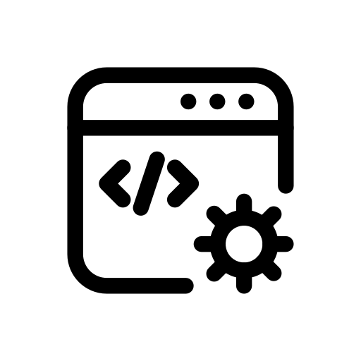

  

<h3 align="center">Backend Roadmap</h3>

  Um repositório de estudos sobre <strong>programação backend</strong>, seguindo o guia do 
  <a href="https://roadmap.sh/backend">roadmap.sh/backend</a>.

  

## Sobre o Projeto

Este repositório é o meu caderno de estudos pessoal sobre desenvolvimento backend, seguindo a trilha do roadmap.sh.

O objetivo é registrar, de forma organizada, tudo o que eu aprendo: conceitos, anotações, exemplos etc.

Aqui, vou registrar e explicar o que aprendi em cada tópico, priorizando um entendimento que faça sentido para mim. Este material será minha base para estudar e revisar futuramente conceitos fundamentais que, com o tempo, poderiam cair na curva do esquecimento.

